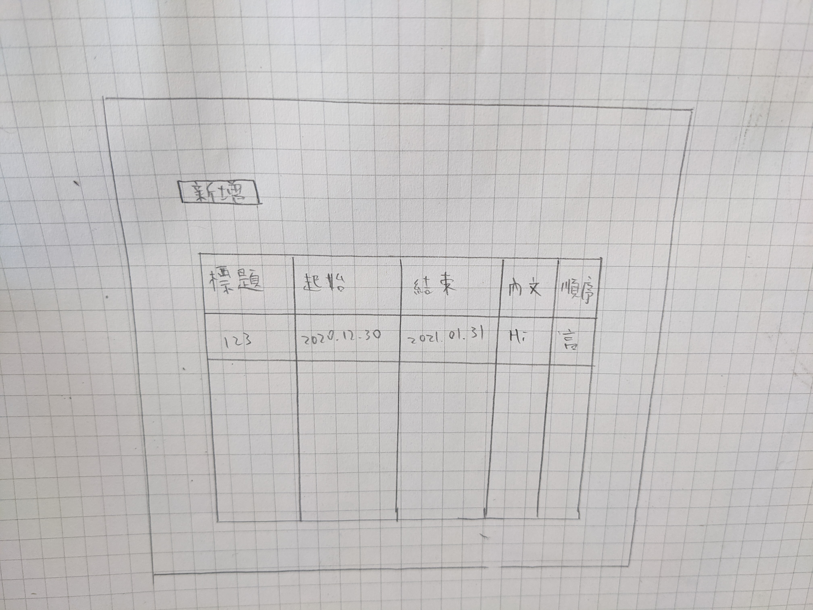
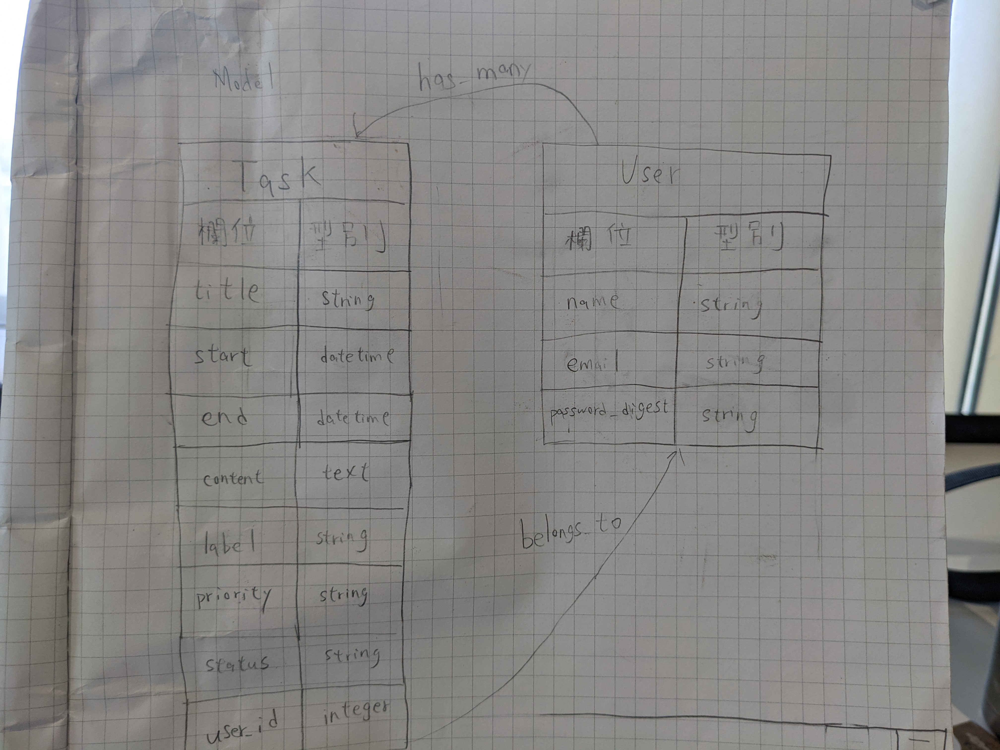

# README
# [task-management連結](https://task-management123.herokuapp.com/)
### 版號
* Rails 6.1.4
* ruby 2.7.2
* PostgreSQL 13.3
### 部署流程
1. `heroku login`
2. `heroku create task-management123`
3. `git push heroku master`（執行後噴出錯誤訊息
3. 根據錯誤訊息執行`bundle lock  --add-platform x86_64-linux`
4. 執行完需重新commit
5. `git push` （推上GitHub上master分支
6. `git push heroku master`(再次執行
7. `heroku run rails db:migrate` (部署環境建立資料

### Task
| column | datatype |
| ------ | -------- |
| title  | string   |
| start  | datetime |
|  end   | datetime |
| content| text     |
| label  | string   |
|priority| status   |
| user_id| string   |

### User

| cloumn | datatype |
| ------ | -------- |
| name   | string   |
| email  |string    |
|password| string   |

