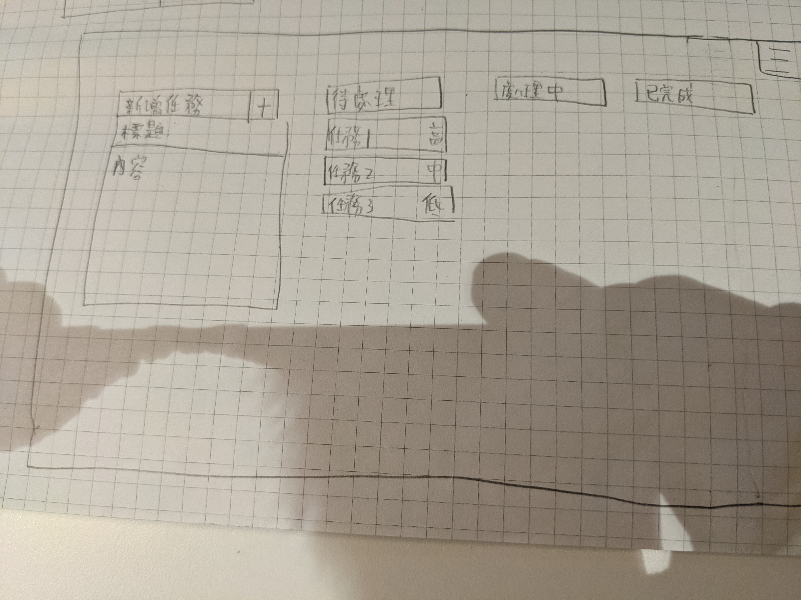
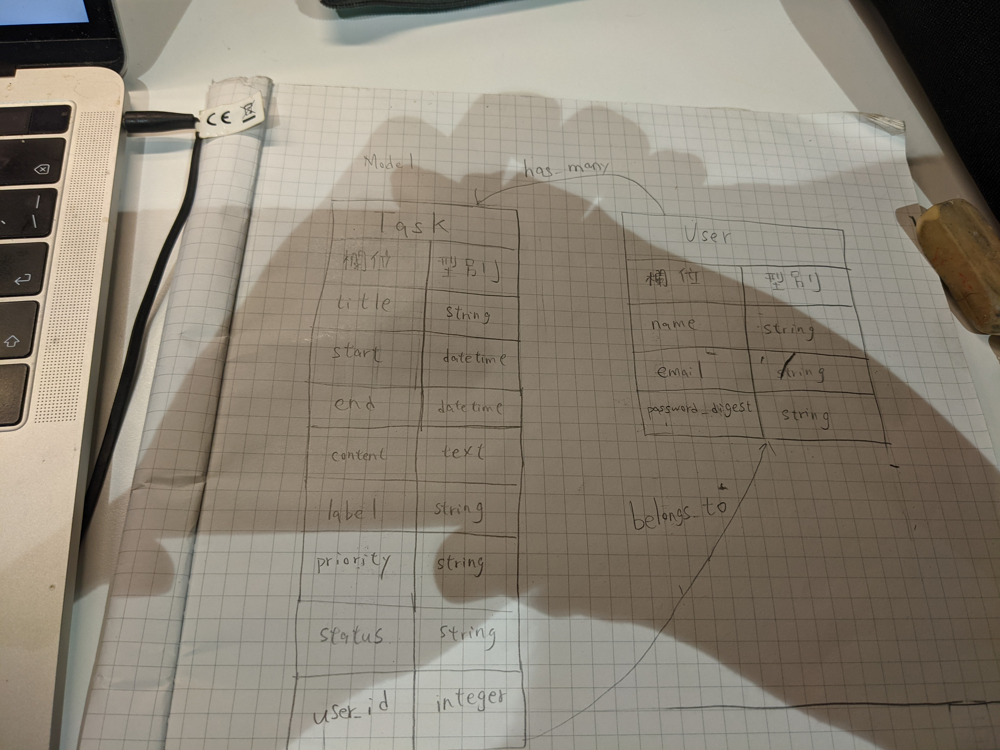

# README
### 版號
* Rails 6.1.4
* ruby 2.7.2
* PostgreSQL 13.3
### 部署流程

### Task 
| column | datatype |
| ------ | -------- |
| title  | string   |
| start  | datetime |
|  end   | datetime |
| content| text     |
| label  | string   |
|priority| status   |
| user_id| string   |

### User

| cloumn | datatype |
| ------ | -------- |
| name   | string   |
| email  |string    |
|password| string   | 

